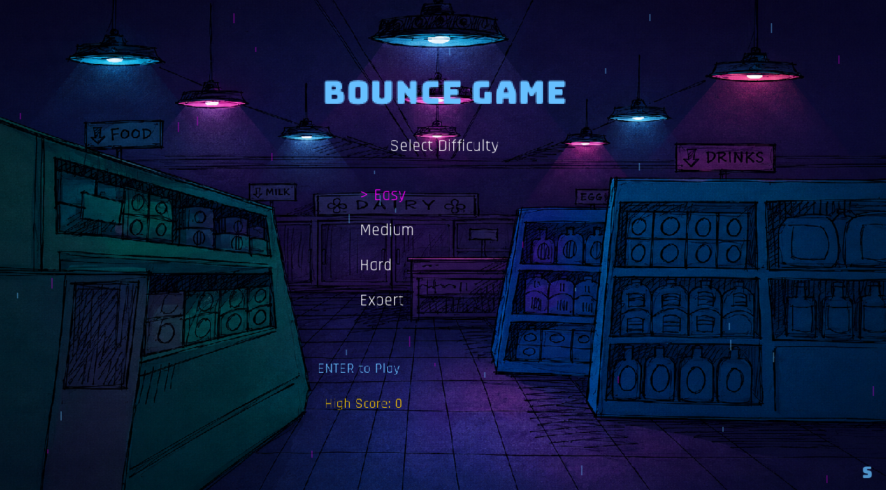
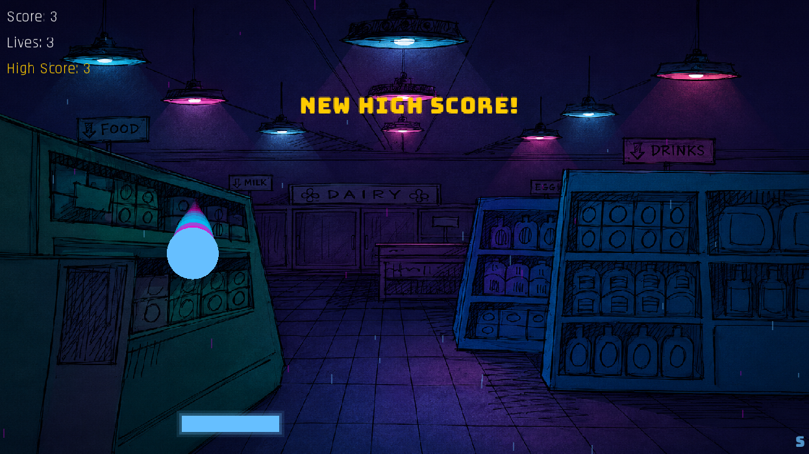
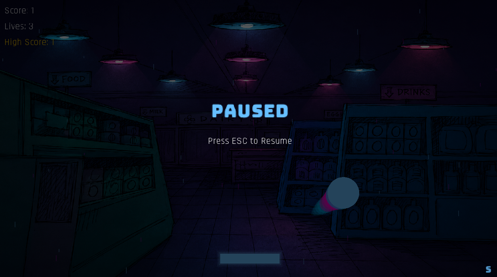
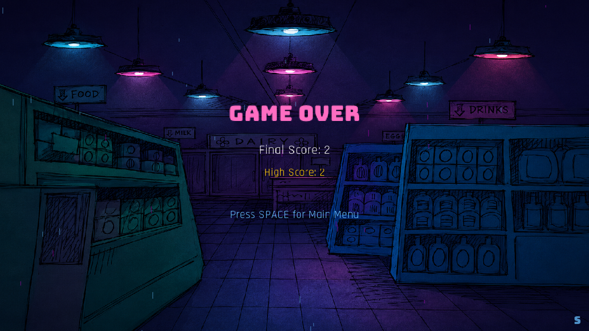

# 🎮 BounceGame

A fast-paced 2D arcade game built from scratch in **C++ using Raylib**.

Bounce the ball using your paddle, survive as long as possible, and chase higher scores as the game progressively becomes faster and more intense.

The game features a custom neon-retro visual style, animated ball trails, dynamic rain particles, multiple difficulty levels, music, sound effects, and persistent high scores.

---

## 📸 Screenshots

### Main Menu



### Gameplay



### Pause Screen



### GameOver Screen



---

## ✨ Features

- 🎮 Smooth paddle-based arcade gameplay
- ⚡ Increasing ball speed as the game progresses
- 🎯 Four difficulty levels
  - Easy
  - Medium
  - Hard
  - Expert
- 🏆 Separate persistent high scores for each difficulty
- 🌧️ Dynamic rain particle system
- 🚀 Rain intensity increases with score and difficulty
- 💫 Animated neon ball trail
- 🎵 Menu and gameplay music
- 🔊 Sound effects
- ⏸️ Pause and resume system
- 🎨 Custom retro/neon visual theme
- 🔤 Custom fonts
- 🖥️ Standalone Windows build

---

## 🕹️ Controls

| Key | Action |
| --- | --- |
| Arrow Keys | Move paddle / Navigate difficulty menu |
| Enter | Start game |
| ESC | Pause / Resume |
| Space | Return to Main Menu after Game Over |

---

## 🚀 Download & Play

Download the latest version from the **Releases** section of this repository.

1. Download `BounceGame-v1.0.zip`
2. Extract the ZIP file
3. Open the extracted folder
4. Run `BounceGame.exe`
5. Enjoy!

> Currently, the pre-built release is available for Windows.

---

## 🛠️ Built With

- C++17
- Raylib
- CMake
- MSYS2 UCRT64

---

## 🔨 Build From Source

### Requirements

- C++17 compatible compiler
- CMake
- Raylib

Clone the repository:

```bash
git clone YOUR_REPOSITORY_URL
cd BounceGame